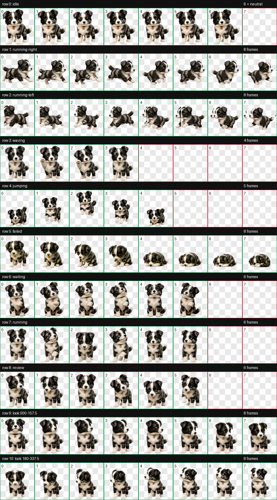

# 桌面宠物-桌面小狗

> 不需要喂养，不要求抚摸，也不会老去。她是一只拥有永久生命的电子小狗。


她叫 **妹妹**，是一只陨石纹边境牧羊犬：石墨黑、银灰和白色毛发，宇宙蓝眼睛，戴着铜色名牌。

安装后，妹妹会在 Mac 桌面底部散步、休息和玩耍。她不会因为你忘记上线而饥饿，不需要每日打卡，也没有健康值、成长值或死亡机制。你不必照顾她；但当你想互动时，可以点击、拖动或把鼠标放到她身上。

这个仓库同时包含：

- 一个可以直接运行的 **macOS 桌面小狗 App**。
- 一套可以安装进 Codex 的 **v2 动画宠物资源**。
- 一个让 Codex 能够安装、检查和维护妹妹的 **Codex Skill**。

## 妹妹能做什么？

### 永久生命，零养成负担

- 不需要喂食、洗澡、遛狗或清理。
- 不要求每天抚摸，也不会因为长期不互动而惩罚你。
- 没有金币、体力、等级或付费养成系统。
- 不会生病、衰老或死亡；只要 App 和资源还在，她就会一直回来。

### 在桌面自由活动

- 自己向左或向右散步，也会待机、挥爪、跳跃和玩耍。
- 点击妹妹，会触发一次互动动作。
- 向上拖动她，会出现“被拎着后颈提起来”的悬空动作；松手后自然落回桌面。
- 把她放在屏幕左下角或右下角，5 分钟没有互动后，她会躲进边框。
- 当鼠标移到露在边框外的部分，她会跳出来并停留在原来的桌角。
- 她会偶尔用本地气泡讲一个冷笑话。

### 工作时不打扰

- 开始打字时自动隐藏，停止输入约 3 秒后再回来。
- 前台窗口全屏，或正在使用 TV、QuickTime Player、VLC、IINA 等播放器时自动隐藏。
- 浏览器窗口化看剧时，可以从菜单栏爪印开启「观影模式」。
- 每小时检查一次工作状态；只有最近 5 分钟仍有电脑操作时，才用桌面气泡提醒活动和喝水。
- 活动喝水气泡显示 10 秒后自动消失；如果她原本藏在边框里，提醒结束后还会躲回去。

## 最快开始

适用于 **Apple Silicon Mac**，需要 macOS 13 或更高版本。

```bash
git clone https://github.com/ielcharme/desktop-pet-dog.git
cd desktop-pet-dog

# 检查 App、动画图集、架构和签名
./scripts/verify_assets.sh

# 预览安装位置，不修改任何文件
./scripts/install.sh --target desktop --dry-run

# 安装到 ~/Applications/妹妹.app
./scripts/install.sh --target desktop --install

# 启动妹妹
open "$HOME/Applications/妹妹.app"
```

妹妹启动后会出现在当前屏幕底部。菜单栏右上角会出现一个爪印，可以用来：

- 叫妹妹过来
- 和妹妹玩
- 让妹妹讲冷笑话
- 开启或退出观影模式
- 暂停散步
- 隐藏妹妹
- 退出妹妹

App 不会自动设置开机启动。需要完全退出时，请使用菜单栏爪印里的「退出妹妹」。

## 更新已经安装的妹妹

安装器不会静默覆盖现有 App。确认要更新后运行：

```bash
./scripts/install.sh --target desktop --install --replace
./scripts/verify_assets.sh --installed desktop
```

公开安装脚本默认把旧版移动为带时间戳的同级备份，再安装新版。

## 安装成 Codex 宠物

桌面 App 和 Codex 宠物是两个独立模式：

| 模式 | 妹妹出现在哪里 | 适合什么情况 |
| --- | --- | --- |
| macOS 桌面 App | Mac 桌面 | 想让妹妹长期陪伴、散步和提醒休息 |
| Codex v2 宠物 | Codex 界面 | 想让妹妹跟随 Codex 的任务状态切换动作 |
| 两者同时安装 | 两个位置 | 希望桌面和 Codex 都有妹妹 |

只安装 Codex 宠物：

```bash
./scripts/install.sh --target codex --dry-run
./scripts/install.sh --target codex --install
```

同时安装两个版本：

```bash
./scripts/install.sh --target all --dry-run
./scripts/install.sh --target all --install
```

## 安装 Codex Skill

安装 Skill 后，可以在新的 Codex 任务中直接说“安装妹妹”“检查妹妹”或“重新构建桌面妹妹”。

```bash
npx -y skills add https://github.com/ielcharme/desktop-pet-dog
```

调用示例：

```text
使用 $meteor-meimei-pet，把妹妹安装成 macOS 桌面宠物并启动。
使用 $meteor-meimei-pet，把妹妹安装成我的 Codex 宠物。
使用 $meteor-meimei-pet，同时安装桌面版和 Codex 版妹妹。
使用 $meteor-meimei-pet，检查妹妹的资源是否完整。
```

Skill 会先验证资源并显示实际安装位置。写入 Codex 宠物目录或 `~/Applications` 前，应先获得用户确认。

## 大小与动作

桌面妹妹会读取 `~/.codex/config.toml` 中的 `avatar-overlay-mascot-width-px`，与 Codex 当前宠物宽度保持 1:1。没有该设置时，默认宽度为 `97 px`，高度按照原始 `192:208` 单元格比例计算，不会拉伸。

为了让小尺寸动作更自然：

- 向左散步使用已确认的向右步态逐帧镜像，保持原始帧顺序。
- 步行速度为 `5.2 fps`，并对齐屏幕像素，减少向左移动时的顿挫。
- 待机、卖萌、检查和玩耍动作采用较慢节奏，并穿插更长休息时间。

<details>
<summary>查看妹妹的全部动画帧</summary>



</details>

## 隐私与安全

妹妹是一个本地 App：

- 不联网，不调用在线 AI，也不上传数据。
- 不读取 Codex 对话、浏览器页面、屏幕画面、账户或凭据。
- 不记录具体按键，只读取“距离上次按键或操作过去了多久”。
- 只读取前台 App 标识和窗口尺寸，用于判断全屏与观影状态。
- 不申请辅助功能、屏幕录制、麦克风或摄像头权限。
- 不创建开机启动项，也没有遥测或广告。

浏览器里的非全屏视频无法在不读取页面内容的前提下可靠识别，因此需要手动开启观影模式。

## 从源码构建

需要 macOS 13 或更高版本，以及 Xcode Command Line Tools。

```bash
./scripts/build_desktop_app.sh
./scripts/verify_assets.sh --app dist/妹妹.app
```

构建结果位于 `dist/妹妹.app`。构建脚本使用 Cocoa 和 ApplicationServices，并进行本地 ad-hoc 签名；这适合本机使用，但不等于 Apple Developer ID 签名或 Apple 公证。

## 仓库结构

```text
desktop-pet-dog/
├── SKILL.md                         # Codex Skill 核心说明
├── agents/openai.yaml               # Skill 显示信息与默认调用提示
├── assets/
│   ├── pet/                         # Codex v2 图集、清单与 QA 预览
│   ├── desktop/妹妹.app             # 已构建的 Apple Silicon App
│   └── desktop-source/              # 可审查的 Objective-C 源码
├── references/asset-contract.md     # 动画、尺寸与行为约束
└── scripts/
    ├── install.sh                   # 安装与更新
    ├── verify_assets.sh             # 资源和 App 校验
    └── build_desktop_app.sh         # 从源码构建 App
```

## 常见问题

### 妹妹真的不需要喂养和抚摸吗？

是的。这个项目没有饥饿值、亲密度或每日任务。抚摸和点击只是可选互动，不会影响她的生命或状态。

### “永久生命”是什么意思？

这是妹妹的角色设定：她不会因为时间、缺少喂养或长期不互动而衰老和死亡。只要 App 没有被删除，你随时可以再次启动她。

### 为什么安装 Skill 后，桌面上没有妹妹？

Skill 是给 Codex 使用的操作说明，不是正在运行的桌面程序。还需要安装并启动 `妹妹.app`。

### 冷笑话和喝水提醒需要联网吗？

不需要。笑话、计时和工作状态判断全部在本机完成。提醒气泡会自动消失，也不会发送到 Codex 聊天。

### 支持 Intel Mac 或 Windows 吗？

当前预编译 App 是 Apple Silicon `arm64` 版本，不支持 Intel Mac 或 Windows。Codex 宠物图集本身不依赖桌面 App。

## 授权说明

仓库当前没有附加开源许可证。公开可见不代表获得复制、改编、再发布或商业使用授权；如需开放授权，应由作者另行添加明确的许可证。

## English summary

**Desktop Pet – Desktop Puppy** is a local macOS companion featuring Meimei, a meteor-pattern border collie. She needs no feeding, mandatory petting, daily check-ins, or paid progression and is designed as an electronic puppy with permanent life. She roams, plays, hides during focused work or video playback, tells offline jokes, and shows self-dismissing hourly movement-and-water reminders during active computer use.
