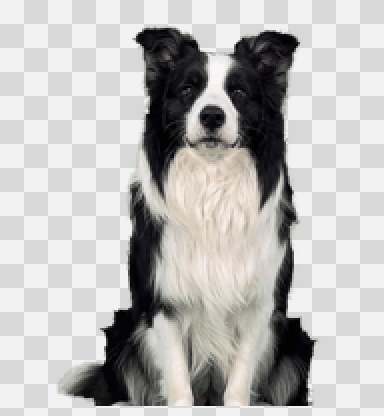
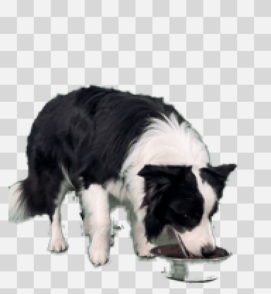
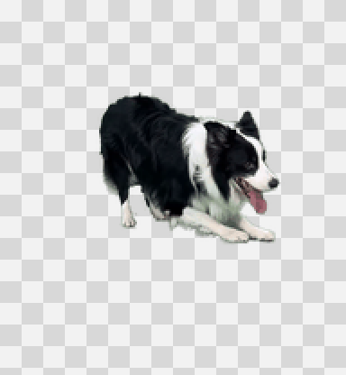
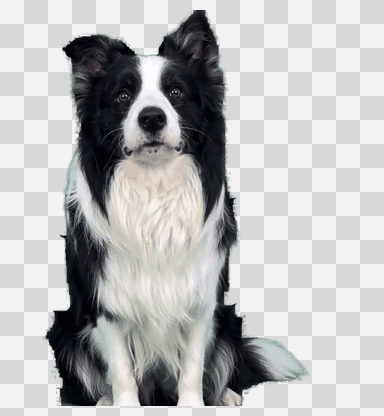
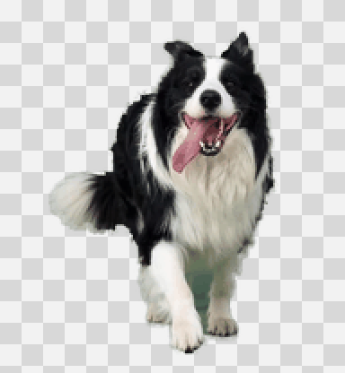
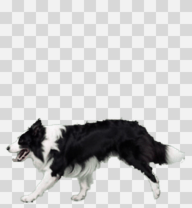
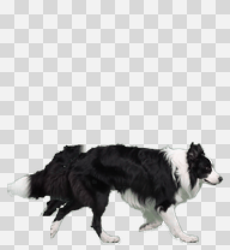
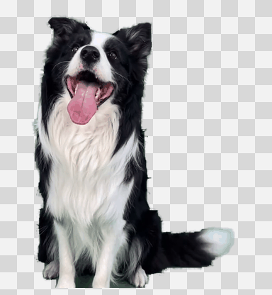
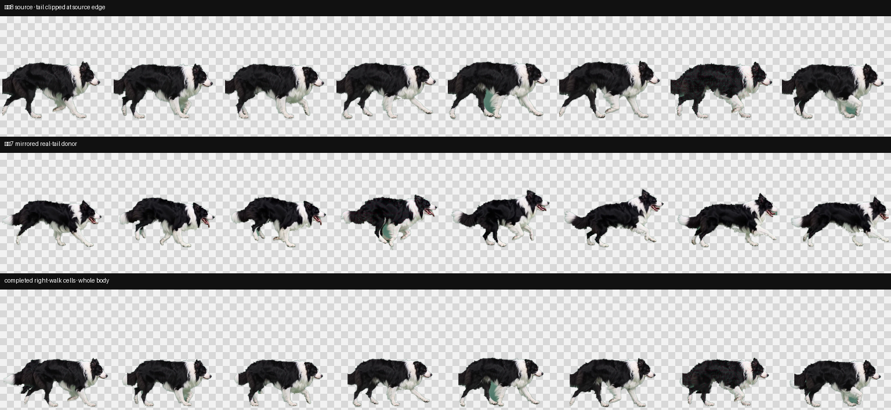

# Desktop Pet – Desktop Puppy / 桌面宠物-桌面小狗

> No feeding. No mandatory petting. Permanent life. A tiny electronic puppy who stays with you without becoming another responsibility.

> 不需要喂养，不要求抚摸，拥有永久生命。一只陪伴你、却不会增加照顾负担的电子小狗。


[English](#english) · [中文对照](#中文对照)

<a id="english"></a>

## English

### Meet Meimei

Meimei (妹妹) is a meteor-pattern border collie with graphite-black, silver, and white fur, cosmic-blue eyes, and a copper name tag.

Install her as a small macOS desktop companion and she will walk, rest, play, hide at the edge of the screen, tell offline jokes, and gently look after your work rhythm.

Meimei has no hunger bar, health bar, daily check-in, growth system, or death mechanic. You never have to feed or pet her. Interaction is optional: she remains alive and ready to return whenever the app is still installed.

This repository contains:

- A ready-to-run **macOS desktop puppy app**.
- A complete **Codex v2 animated pet**.
- A reusable **Codex Skill** for installing, verifying, and maintaining Meimei.

### Why keep a desktop puppy?

#### Permanent life, zero care pressure

- No feeding, bathing, walking schedule, or cleanup.
- No required petting and no punishment for being away.
- No coins, energy, levels, subscriptions, or paid progression.
- No illness, ageing, or death caused by time or lack of attention.

#### A small companion that can play

- Walks left and right, rests, greets, plays, and asks for attention at a relaxed pace.
- Includes eight desktop-only actions cut directly from the latest real border-collie green-screen footage: head tilt, eating, rolling over, waiting, startup, walking left, walking right, and an expectant look.
- Greeting uses the head-tilt clip; edge emergence and upward dragging use the expectant/approach clip; focused review uses waiting. Startup plays once when the app opens.
- Changes actions through completed endpoint holds and a gentle crossfade instead of a hard cut.
- Single-click Meimei for a playful action; double-click her to hear an offline cold joke immediately.
- Move the pointer back and forth over her body to pet her; after recognizing the petting gesture, she responds with her expectant “coming closer” action. A short cooldown prevents accidental repeats.
- When dragged upward, Meimei follows the pointer with her expectant “coming closer to you” action and drops naturally when released.
- During recent computer use, her rolling/belly-up action appears naturally about once every 8–18 minutes; the menu and single-click play can still trigger it directly.
- After three minutes without direct interaction, she plays a smooth little routine in this exact order: walk left → head tilt → roll → walk right. If she is still left alone, the routine can repeat after another three minutes, so rolling appears more often without making ordinary action changes busier.
- Eating is scheduled only three times a day in local time: `08:30`, `12:00`, and `19:00`. Each meal lasts 30 minutes; random play, clicks, petting, and the action menu do not add extra meals.
- When parked in a bottom corner and ignored for five minutes, she retreats into the screen edge.
- Hover over the visible edge of her body and she jumps back out to the same corner.
- Occasionally tells a bundled offline cold joke in a speech bubble, even without interaction.
- Spends much longer resting and is less likely to switch into an autonomous action, so she feels calm rather than busy.

#### Long-work rest and water reminders

Meimei helps when you have been working at the computer for a long time:

- Once per hour, she checks whether the Mac has been actively used during the previous five minutes.
- When active work is detected, she appears on the desktop and reminds you to stand up, move for 2–5 minutes, and drink some water.
- The reminder is spoken through Meimei’s own desktop speech bubble—not through a Codex chat notification.
- The bubble closes automatically after 10 seconds and never remains permanently on the desktop.
- If Meimei was hiding inside the screen edge, she returns there after the reminder.
- If the Mac is idle, Meimei is paused or hidden, or you are watching a video, that hourly reminder is skipped.
- If you are typing at the exact reminder time, she waits until typing has stopped for about three seconds so she does not cover the input area.

#### Designed not to interrupt work or video

- Hides automatically while you type and returns about three seconds after keyboard activity stops.
- Hides when the foreground window is full-screen.
- Hides while Apple TV, QuickTime Player, VLC, IINA, and other recognized media players are active.
- For windowed video inside a browser, use **Cinema Mode** from the paw menu.

### Quick start

Requirements: Apple Silicon Mac and macOS 13 or later.

```bash
git clone https://github.com/ielcharme/desktop-pet-dog.git
cd desktop-pet-dog

# Verify the app, animation atlas, architecture, and signature
./scripts/verify_assets.sh

# Preview the destination without changing files
./scripts/install.sh --target desktop --dry-run

# Install to ~/Applications/妹妹.app
./scripts/install.sh --target desktop --install

# Launch Meimei
open "$HOME/Applications/妹妹.app"
```

After launch, a paw icon appears in the macOS menu bar. Its menu can:

- Call Meimei to the current screen
- Play with Meimei
- Choose a specific action: head tilt, roll, wait, startup, or expectant look
- Ask for a cold joke
- Enable or disable Cinema Mode
- Pause walking
- Hide Meimei
- Quit Meimei

The app does not add itself to Login Items. To close it completely, choose **Quit Meimei** from the paw menu.

You can also place the pointer over Meimei, right-click, and choose **Temporarily Quit Meimei**. This closes the app without uninstalling it; open `~/Applications/妹妹.app` whenever you want her back.

### Update an installed app

The public installer does not silently overwrite an existing copy. To update:

```bash
./scripts/install.sh --target desktop --install --replace
./scripts/verify_assets.sh --installed desktop
```

For public installations, `--replace` moves the previous copy to a timestamped sibling backup before installing the new one.

### Desktop app, Codex pet, or both

| Mode | Where Meimei appears | Best for |
| --- | --- | --- |
| macOS desktop app | On the Mac desktop | Walking, play, jokes, and long-work wellness reminders |
| Codex v2 pet | Inside Codex | Animations that follow Codex task states |
| Both | Desktop and Codex | Keeping the same Meimei in both environments |

Install only the Codex pet:

```bash
./scripts/install.sh --target codex --dry-run
./scripts/install.sh --target codex --install
```

Install both versions:

```bash
./scripts/install.sh --target all --dry-run
./scripts/install.sh --target all --install
```

### Install the Codex Skill

The Skill lets you ask Codex to install, inspect, restore, or rebuild Meimei.

```bash
npx -y skills add https://github.com/ielcharme/desktop-pet-dog
```

Example prompts:

```text
Use $meteor-meimei-pet to install and launch Meimei as my macOS desktop pet.
Use $meteor-meimei-pet to install Meimei as my Codex pet.
Use $meteor-meimei-pet to install both the desktop and Codex versions.
Use $meteor-meimei-pet to verify that Meimei's assets are complete.
```

The Skill verifies the package and shows the resolved destination before writing outside the repository.

### Size and animation

The desktop app keeps Meimei at the repository's small `97 px` resting width, with height derived from the original `192:208` aspect ratio. Walking left, walking right, and rolling all expand smoothly to `1.5×` from the bottom center so her complete body stays visible. It also prohibits multiple running instances, so opening Meimei again reuses the one already on screen.

- Leftward and rightward movement keep their own source-body motion. Because every frame of the supplied right-walk clip cuts off the tail, only the missing tail is completed frame by frame from mirrored real-tail pixels in the paired left-walk clip.
- Walking runs at `5.0 fps`, with tracked baseline normalization and backing-pixel alignment to reduce small-size jitter.
- Real-dog waiting runs at `1.4 fps`; other non-walking actions remain deliberately calm.
- The eight real-dog actions run at `1.4–5.0 fps` and live in a separate desktop-only atlas. It uses lossless WebP at `3072×3328`, with `384×416` cells—twice the former pixel dimensions—and high-quality interpolation. This keeps all useful detail available from the original `720×720` MP4 files, including at `1.5×` Retina rendering. The validated Codex `8×11` atlas remains unchanged.
- One-shot actions hold their first and last frames instead of wrapping abruptly back to frame 1. Every action change then blends the outgoing terminal frame into the incoming head frame for `0.62 s` before the new animation continues.
- Autonomous walks and playful actions are deliberately uncommon, with `10–22 s` resting periods between most decisions.

<details>
<summary>View the eight desktop action previews</summary>

| Head tilt | Eating | Rolling | Waiting |
| --- | --- | --- | --- |
|  |  |  |  |

| Startup | Walking left | Walking right | Expectant look |
| --- | --- | --- | --- |
|  |  |  |  |

The source MP4 files provide the final dog pixels and real motion. Their green backgrounds are removed frame by frame, then stored in a lossless 2× desktop atlas without another lossy video encode. The missing right-walk tail is reconstructed locally from the paired real left-walk tail; no online generation service is used. The app contains only the transparent action atlas, while the original videos are not bundled or uploaded.



</details>

<details>
<summary>View the complete animation atlas</summary>


</details>

### Privacy and safety

Meimei is local-only:

- No network requests, online AI calls, telemetry, or advertising.
- No access to Codex conversations, browser pages, screen pixels, accounts, or credentials.
- No key-content recording; the app only reads how long it has been since the last key or input event.
- Frontmost-app identity and window geometry are used only for full-screen and video protection.
- No Accessibility, Screen Recording, microphone, or camera permission.
- No automatic Login Item.

Windowed browser video cannot be detected reliably without inspecting page content, so Cinema Mode is intentionally manual in that case.

### Build from source

Requires macOS 13 or later and Xcode Command Line Tools.

```bash
./scripts/build_desktop_app.sh
./scripts/verify_assets.sh --app dist/妹妹.app
```

The output is `dist/妹妹.app`. The build uses Cocoa and ApplicationServices with a local ad-hoc signature. This is suitable for local use but is not Apple Developer ID signing or Apple notarization.

### Repository structure

```text
desktop-pet-dog/
├── SKILL.md                         # Core Codex Skill instructions
├── agents/openai.yaml               # Skill display metadata and default prompt
├── assets/
│   ├── pet/                         # Codex v2 atlas, manifest, and QA previews
│   ├── desktop/妹妹.app.zip         # Prebuilt Apple Silicon app archive
│   └── desktop-source/              # Reviewable Objective-C source
├── references/asset-contract.md     # Animation, size, and behavior contract
└── scripts/
    ├── install.sh                   # Installation and replacement
    ├── verify_assets.sh             # Asset and app verification
    └── build_desktop_app.sh         # Local app build
```

### FAQ

#### Does Meimei really need no feeding or petting?

Yes. There is no hunger, affection score, or daily task. Clicking and petting are optional interactions and do not affect her life.

#### What does “permanent life” mean?

It is part of Meimei’s design: she never ages or dies because of time, missing food, or lack of attention. As long as the app remains installed, you can always launch her again.

#### Will the rest and water reminder stay on screen?

No. During long active work, the desktop bubble appears once per hour and closes automatically after 10 seconds. It is skipped during inactivity and video playback.

#### Why does installing the Skill not put Meimei on my desktop?

The Skill is an instruction and asset package for Codex. The desktop app must also be installed and launched.

#### Does the app support Intel Mac or Windows?

The prebuilt app is currently Apple Silicon `arm64` only. The Codex pet atlas is independent from the desktop app.

### License

No open-source license is currently attached. Public visibility does not grant permission to copy, modify, redistribute, or use the project commercially.

---

<a id="中文对照"></a>

## 中文对照

### 认识妹妹

妹妹是一只陨石纹边境牧羊犬：石墨黑、银灰和白色毛发，宇宙蓝眼睛，戴着铜色名牌。

安装后，她会作为一只小型 macOS 桌面宠物散步、休息、玩耍、躲进屏幕边框、讲本地冷笑话，并温柔地照顾你的工作节奏。

妹妹没有饥饿值、健康值、每日签到、成长系统或死亡机制。你不需要喂养她，也不必每天抚摸她。互动完全自愿；只要 App 还在，她就拥有永久生命，随时可以再次回来。

这个仓库包含：

- 可以直接运行的 **macOS 桌面小狗 App**。
- 完整的 **Codex v2 动画宠物资源**。
- 用于安装、检查和维护妹妹的 **Codex Skill**。

### 为什么需要一只桌面小狗？

#### 永久生命，零照顾压力

- 不需要喂食、洗澡、固定遛狗或清理。
- 不要求每天抚摸，长期离开也不会惩罚你。
- 没有金币、体力、等级、订阅或付费养成。
- 不会因为时间流逝或缺少关注而生病、衰老或死亡。

#### 会自己玩耍的小陪伴

- 用松弛的节奏左右散步、休息、打招呼、玩耍和期待互动。
- 直接从最新真实边牧绿幕视频中抠出八个桌面专属动作：歪头杀、吃饭、打滚、等待、开机启动、向左走、向右走和一脸期待。
- 打招呼使用歪头杀；从边框跳出和向上拖动使用“一脸期待／靠近你”；专注查看使用等待。App 打开时会完整播放一次开机启动。
- 不同动作会先完整保留首帧和尾帧，再使用柔和的“上一动作尾帧 → 下一动作首帧”过渡，不再硬切。
- 单击妹妹会触发互动动作；双击妹妹会马上讲一个本地冷笑话。
- 在妹妹身上来回移动鼠标，就像抚摸她一样；识别到抚摸后会播放“一脸期待／靠近你”，并设有短暂冷却，避免误触后连续播放。
- 向上拖动时，她会跟随鼠标播放“一脸期待／靠近你”；松手后自然落回桌面。
- 电脑近期有人使用时，妹妹大约每隔 8–18 分钟会自然地打滚、翻肚皮一次；菜单和单击玩耍仍然可以直接触发。
- 连续 3 分钟没有直接互动后，妹妹会按固定顺序表演一段连贯的小剧场：向左走 → 歪头杀 → 打滚 → 向右走。如果还是没人理她，再过 3 分钟可以重复一次；这样打滚会更常出现，但普通动作切换不会变得更忙。
- 吃饭只按本机时间每天出现三次：早上 `08:30`、中午 `12:00`、晚上 `19:00`，每次持续 30 分钟。随机玩耍、单击、抚摸和动作菜单都不会增加额外的吃饭次数。
- 把她放在屏幕左下角或右下角，5 分钟没有互动后，她会躲进屏幕边框。
- 鼠标放到露在边框外的部分时，她会跳出来并停在原来的桌角。
- 即使没有互动，她也会偶尔用桌面气泡讲一个内置的本地冷笑话。
- 自动散步和玩耍的概率已经降低，大部分时间会安静地休息，不会显得一直很忙。

#### 长时间工作时提醒休息和喝水

当你长时间使用电脑工作时，妹妹会照顾你的休息节奏：

- 每小时检查一次最近 5 分钟内是否仍有电脑操作。
- 检测到正在工作时，妹妹会出现在桌面，提醒你起身活动 2–5 分钟并喝几口水。
- 提醒通过妹妹自己的桌面对话气泡出现，不会发送到 Codex 聊天。
- 气泡 10 秒后自动消失，不会长期停留在桌面上。
- 如果妹妹原本藏在屏幕边框里，提醒结束后她还会躲回去。
- 电脑闲置、妹妹被暂停或隐藏、正在全屏或观影时，本轮提醒会跳过。
- 如果提醒到点时你恰好正在打字，她会等待停止输入约 3 秒后再出现，避免挡住输入区域。

#### 工作和看剧时不打扰

- 打字时自动隐藏，停止输入约 3 秒后再回来。
- 前台窗口全屏时自动隐藏。
- 使用 Apple TV、QuickTime Player、VLC、IINA 等播放器时自动隐藏。
- 浏览器窗口化看剧时，可以从菜单栏爪印开启「观影模式」。

### 快速开始

系统要求：Apple Silicon Mac，macOS 13 或更高版本。

```bash
git clone https://github.com/ielcharme/desktop-pet-dog.git
cd desktop-pet-dog

# 检查 App、动画图集、架构和签名
./scripts/verify_assets.sh

# 预览安装位置，不修改文件
./scripts/install.sh --target desktop --dry-run

# 安装到 ~/Applications/妹妹.app
./scripts/install.sh --target desktop --install

# 启动妹妹
open "$HOME/Applications/妹妹.app"
```

启动后，macOS 菜单栏会出现一个爪印，可以：

- 叫妹妹过来
- 和妹妹玩
- 指定妹妹歪头、打滚、等待、开机启动或一脸期待
- 让妹妹讲冷笑话
- 开启或退出观影模式
- 暂停散步
- 隐藏妹妹
- 退出妹妹

App 不会自动加入开机启动项。需要完全关闭时，请从爪印菜单选择「退出妹妹」。

也可以把鼠标放在妹妹身上，右键选择「暂时退出妹妹」。这只会关闭 App，不会卸载；想念她时再打开 `~/Applications/妹妹.app` 即可。

### 更新已经安装的妹妹

公开安装器不会静默覆盖旧版本。确认更新后运行：

```bash
./scripts/install.sh --target desktop --install --replace
./scripts/verify_assets.sh --installed desktop
```

对公开安装，`--replace` 会先把旧版本移动为带时间戳的同级备份，再安装新版。

### 桌面版、Codex 版或同时安装

| 模式 | 妹妹出现在哪里 | 适合什么情况 |
| --- | --- | --- |
| macOS 桌面 App | Mac 桌面 | 散步、玩耍、冷笑话，以及长时间工作时提醒休息和喝水 |
| Codex v2 宠物 | Codex 界面 | 让动画跟随 Codex 的任务状态变化 |
| 同时安装 | 桌面和 Codex | 希望在两个环境中使用同一只妹妹 |

只安装 Codex 宠物：

```bash
./scripts/install.sh --target codex --dry-run
./scripts/install.sh --target codex --install
```

同时安装两个版本：

```bash
./scripts/install.sh --target all --dry-run
./scripts/install.sh --target all --install
```

### 安装 Codex Skill

安装 Skill 后，可以让 Codex 安装、检查、恢复或重新构建妹妹。

```bash
npx -y skills add https://github.com/ielcharme/desktop-pet-dog
```

调用示例：

```text
使用 $meteor-meimei-pet，把妹妹安装成 macOS 桌面宠物并启动。
使用 $meteor-meimei-pet，把妹妹安装成我的 Codex 宠物。
使用 $meteor-meimei-pet，同时安装桌面版和 Codex 版妹妹。
使用 $meteor-meimei-pet，检查妹妹的资源是否完整。
```

Skill 会先验证资源，并在写入仓库外的位置之前显示实际安装目标。

### 大小与动画

桌面 App 的待机尺寸仍是仓库同款的小尺寸：宽 `97 px`，高度按原始 `192:208` 比例计算。向左走、向右走和打滚都平滑放大到 `1.5 倍`，并继续以底部中央为锚点，保证全身完整。App 同时禁止重复运行；再次打开妹妹时，会继续使用屏幕上唯一的那一只。

- 向左走和向右走保留各自素材中的身体动作。由于成片8每一帧都截断了尾巴，程序只使用成片7中真实尾巴的镜像画面，逐帧补齐成片8缺失的尾巴。
- 步行速度为 `5.0 fps`，并用基线跟踪和屏幕像素对齐减少小尺寸移动时的顿挫。
- 真实等待动作使用 `1.4 fps`；其他非步行动作也保持比较松弛的节奏。
- 八个真实狗狗动作使用 `1.4–5.0 fps`，放在单独的桌面版动作图集中。图集采用无损 WebP，尺寸为 `3072×3328`，每格 `384×416`，像素尺寸是旧版的 2 倍，并使用高质量插值；这足以保留原始 `720×720` 成片在 `1.5 倍` Retina 显示时能呈现的有效细节。已验证的 Codex `8×11` 图集保持不变。
- 单次动作会在第 1 帧和最后 1 帧短暂停留，不会在结束时突然跳回开头；换动作时再用 `0.62 秒`从上一动作尾帧平滑过渡到下一动作首帧。
- 自动散步和玩耍会少很多，多数判断之间会先待机 `10–22 秒`，整体更像一只安静生活在屏幕上的小狗。

<details>
<summary>查看八个桌面动作预览</summary>

| 歪头杀 | 吃饭 | 打滚 | 等待 |
| --- | --- | --- | --- |
|  |  |  |  |

| 开机启动 | 向左走 | 向右走 | 一脸期待 |
| --- | --- | --- | --- |
|  |  |  |  |

原始 MP4 同时提供最终的真实狗狗画面和动作。程序会逐帧去掉绿幕，再存入 2 倍分辨率的无损桌面图集，不进行第二次有损视频编码；成片8缺失的尾巴在本机使用成片7的真实尾巴素材补齐，没有调用在线生成服务。App 不会上传或打包原视频。


</details>

<details>
<summary>查看妹妹的完整动画图集</summary>


</details>

### 隐私与安全

妹妹完全在本机运行：

- 不联网，不调用在线 AI，没有遥测或广告。
- 不读取 Codex 对话、浏览器页面、屏幕画面、账户或凭据。
- 不记录具体按键，只读取距离上一次按键或操作过去了多久。
- 只读取前台 App 标识和窗口尺寸，用于判断全屏与观影状态。
- 不申请辅助功能、屏幕录制、麦克风或摄像头权限。
- 不自动创建开机启动项。

浏览器里的非全屏视频无法在不读取页面内容的前提下可靠识别，因此这种情况需要手动开启观影模式。

### 从源码构建

需要 macOS 13 或更高版本，以及 Xcode Command Line Tools。

```bash
./scripts/build_desktop_app.sh
./scripts/verify_assets.sh --app dist/妹妹.app
```

构建结果位于 `dist/妹妹.app`。构建脚本使用 Cocoa 和 ApplicationServices，并进行本地 ad-hoc 签名；这适合本机使用，但不等于 Apple Developer ID 签名或 Apple 公证。

### 仓库结构

```text
desktop-pet-dog/
├── SKILL.md                         # Codex Skill 核心说明
├── agents/openai.yaml               # Skill 显示信息与默认提示
├── assets/
│   ├── pet/                         # Codex v2 图集、清单与 QA 预览
│   ├── desktop/妹妹.app.zip         # 已构建的 Apple Silicon App 压缩包
│   └── desktop-source/              # 可审查的 Objective-C 源码
├── references/asset-contract.md     # 动画、尺寸与行为约束
└── scripts/
    ├── install.sh                   # 安装与更新
    ├── verify_assets.sh             # 资源和 App 校验
    └── build_desktop_app.sh         # 从源码构建 App
```

### 常见问题

#### 妹妹真的不需要喂养和抚摸吗？

是的。项目没有饥饿值、亲密度或每日任务。点击和抚摸只是可选互动，不会影响她的生命。

#### “永久生命”是什么意思？

这是妹妹的设定：她不会因为时间、没有食物或缺少关注而衰老和死亡。只要 App 还在，你随时可以再次启动她。

#### 休息和喝水提醒会一直留在屏幕上吗？

不会。长时间工作时，桌面气泡每小时最多出现一次，并在 10 秒后自动关闭。电脑闲置或观影时不会提醒。

#### 为什么安装 Skill 后，桌面上没有妹妹？

Skill 是给 Codex 使用的指令和资源包。还需要另外安装并启动桌面 App。

#### 支持 Intel Mac 或 Windows 吗？

当前预编译 App 只支持 Apple Silicon `arm64`。Codex 宠物图集本身不依赖桌面 App。

### 授权说明

仓库当前没有附加开源许可证。公开可见不代表获得复制、修改、再发布或商业使用授权。
